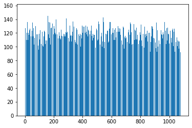

README -- Statistics Part

## How to do:

---

- Initialize 10 computer players are ready to play the game.
- Let these 10 computer players to play 200000 turns games with normal mode.
- Get the number of the appearance of each set card.
- Record each unique sets and its occurrence times into a text file.

## What conclusions can be drawn from it:

---

- There are 1080 unique sets.
- The number of occurrence times of 1080 unique sets are approximately uniform distribution.
- Plot the line chart for these data:
    + the x-label is 1080 unique sets
    + the y-label is the occurrence time of each unique sets
    + 